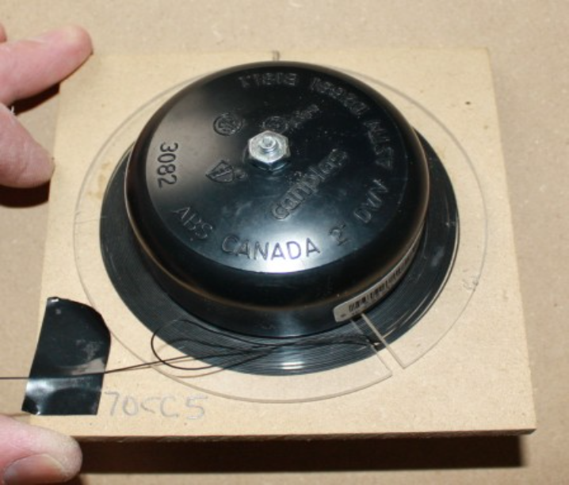

# TESLA WIRELESS POWER TRANSMISSION

# Open source project By Steve Jackson

## Created APR 21, 2011
## Edited FEB 28, 2023 with Authors permission by M.Kemp 

# REPLICATION INSTRUCTIONS

#### steve.jackson@ieee.org

Our mission is simply to wind a single-layer spiral coil. That is the whole “secret” to Tesla's
wireless power transmission. It is just a special kind of Antenna geometry. There are no active
devices like Transistors or Tunnel Diodes. No mysterious Specially Conditioned Crystals are
required. Just a length of ordinary insulated copper wire. “ **_How can it be so simple_** ”, you may
ask. Well, simple is elegant.
Please read the 25 Steps which follow, before starting work. This will give you a good
orientation for the tasks ahead.


- **Appendix 1** lists the materials required.
- **Appendix 2** gives a brief history of this project.
- **Appendix 3** is a NOTE TO DE-BUNKERS.
- **Appendix 4** is ERIC DOLLARD - SCALAR EXPLAINED
- **Appendix 5** is a link to the 1911 Steinmetz book that details Dielectricity
- **Appendix 6** is a link to Tesla Patent 645,576. You can see the winding directions.
- **Appendix 7** details the Hantek 3X25 Generator operation, and the Tuner Utility.

**A NOTE ON WIRE AND DISC SIZE**


The Instructions that follow will use #30 wire, which is very thin. This is much smaller
wire than Nikola Tesla used, but he was the Master and we are Grasshoppers. We can
learn a great deal about this new electrical physics, and accomplish it safely, using thin
wire and low power levels. First steps first.


At this writing (April 21, 2011) we are still experimenting with different wire and disc
sizes. The Replication Kit may end up using a different wire size and disc size than are
described here. Check the Project website for news.

**DISCLAIMER!**

This Project recreates an invention that was Patented by Nikola Tesla over a century
ago. It is new science which has not been tested and approved by medical authorities.
**_Proceed at your own risk._** Neither the author nor Publisher can be held liable for any
injury or damage, however caused.


## **STEP-BY-STEP SPIRAL COIL WINDING PROCEDURES**

### STEP 1

Collect the shopping list of materials in Appendix 1. In the best **Heathkit®** tradition,
sort these bits and pieces into the wells of a Muffin tray.


### STEP 2

Cut your sheet of 1/4” hardboard into squares measuring 4 ½” on a side. The Big Box
stores will give you two cuts for free so you can leave the store with strips measuring
4.5 x 24”. You only need to slice off 4.5” squares.

A friend with a fixed-blade saw in his basement will do this for a beer (but pay him after
the cuts are made.)

**Do not use 1/8” thick hardboard**, because it warps. We need a perfectly flat base
board surface.


### STEP 3

Mark the center of the base board with cross lines connecting the corners. Drill a
center hole of 1/16” dia. Now drill a second 1/16” dia hole located 3/16” from the center
hole.


### STEP 4

Drill the center hole out to 11/64” dia. (to accept an 8-32 screw).


### STEP 5

Measure the outside diameter of the wire you will be using. #30 Wire-Wrap wire is
about 0.020” (20 thousandths).


### STEP 6

Stack up 3-ring binder Reinforcement Rings until you measure a thickness about
0.005” thicker than the wire. For example, 9 stacked Reinforcement Rings are about

0.024” thick. This will create a generous space for our single spiral winding. But not so
generous that the wire can double up to 2-high!


### STEP 7

Use scissors to cut a 1/16” slot in the stack of Reinforcement Rings.

Stick the pile of Reinforcement Rings over the center hole in the base board.

Position the slot over the 1/16” hole.


### STEP 8

Thread a #8 solder lug onto an 8-32 x 2” screw and push the screw through the center
hole in the base board.

Feed your #30 wire through the adjacent 1/16” hole in the base board from the top, so
the tail end of the wire is on the side with the solder lug and screw head.

Now is the time to strip and solder this wire tail to the solder lug. Why? Because if you
do it later and use up all the wire trying to strip it properly, you will be very sad! Leave
1” of slack in this wire, for future maintenance.

You should buy a stripper that is calibrated for #30 wire, like Paladin PA1118 shown
below.


### STEP 9

Here are the dimensions of the 4” acrylic disc that we will use. A supply of these is
included in our Replication Kit, or you can have a local plastics fabricator make them
for you.


Drill the center hole out to 11/64” diameter.


Sand one edge of the disc using medium grit sandpaper, to take the sharp edge off.
This will prevent slicing the wire's insulation.


Now pull off the protective (blue) layer from both surfaces of the disc.


### STEP 10

Wipe the board surface and disc surface with a cloth to remove all dust.

Install the 4” disc (sanded edge facing the base board) onto the 8-32 screw.

Feed on a #8 lockwasher and an 8-32 hex nut. Be sure that the wire has passed
through the slot in the stack of Reinforcement rings. Now tighten the nut snugly. See
that the gap between the disc and the base board is uniform all around the perimeter.
Rotate the disc so that its slot aligns with the slot in the Reinforcement Rings. Then
you can count Turns as the wire passes the disc slot. And the Turns will be precise
integers from the winding starting point.


### STEP 11

Now you are ready to start your Secondary spiral winding of 70 Turns. Choose your
direction - Clockwise (CW) or Counter-Clockwise (CCW) as seen from the top. For this
Project, we will need to wind at least one CW coil to use as the Transmitter, and one
CCW coil to use as a Receiver. If you are ambitious then wind two CW and two CCW
for a total of 4 coils. This will allow you to experiment with multiple Receiver coils, and
to test the effects of the winding direction. If you live in the Southern Hemisphere,
these rules might be reversed. Try it and let us know!

Wind 4 turns with loose tension - just enough to keep the spiral tight with no gaps. You
may need to remove the disc and add or subtract a Reinforcement Ring to get the
correct gap for your wire thickness.

Let the wire spool turn on a peg so as to avoid wire twists, as shown here:


Now we will need to use a 2” ABS Pipe Cap to hold the disc down during winding.
Otherwise the winding will rise and we will get doubled turns. The cap is just a
temporary aid during winding.

Drill an 11/64” hole in the center of your 2” ABS Pipe Cap. Guide the cap onto the
screw and secure it with a lockwasher and hex nut. Tighten the nut so that the wire has
clearance all around the disc perimeter, but is not ***too loose***. Too loose means that 2
wire diameters can fit into the gap!



Now continue to wind a total of 70 turns on this Secondary winding.

Check frequently to see that the wire has not doubled up. Your clue will be that one
side of the disc has a larger gap than the other sides. Take care that the wire insulation
is not cut or nicked as it passes by the slot in the disc.


### STEP 12

When finished winding the 70 turns, feed the wire up through the slot in the disc and
pull a 2” loop in it. (Meaning about 2” up and 2” back to the slot. This wire will later be
soldered to the terminal strip lugs.

Now continue winding your Primary winding, making 5 turns continuing in the same
direction that you chose for the Secondary.

Tape the wire end to the disc, so the winding does not unravel.

Now you can remove the pipe cap, and marvel at the beauty and uniformity of your
perfect spiral coil!

If you are not satisfied, then unwind the wire down the hallway, and start again.

Doubled turns are not good - we really do need Perfection. We need to meet the high
standards set by Nikola Tesla.

### STEP 13

Place a Terminal Strip in your bench vice and use your drill to remove the brass right-
angle mounting foot bracket. Use our favorite 11/64” drill bit.

See the second photo below - the bracket is GONE.


### STEP 14


Turn a second 8-32 hex nut onto the screw protruding from the center of the coil that
was just wound, and turn it so it sits on top of the first nut. Tighten this nut with pliers.
This second nut is just to act as a spacer for the terminal strip, to lift it clear of the disc.

Now place the terminal strip on the screw and add a lockwasher and start another 8-
hex nut. Leave the terminal strip loose on the screw for now. Do not tighten the nut
until after we have soldered the wires to the terminal strip. This makes it much easier
to fish the fine #30 wires up into the terminal strip holes from below.

### STEP 15

Now we are ready to strip the insulation from the #30 wire ends, and solder them to the
correct terminal lugs. This is a bit tricky - so have a look at this connection diagram:


The center end of the Secondary winding goes to the solder lug on the bottom of the
board - this is Pin 1.

The outside end of the Secondary winding goes to Pin 2 on the strip.

The inside end of the Primary winding goes to Pin 5.

The outside end of the Primary winding goes to Pin 6.

I feed these #30 wires up from below the strip into the center hole of each lug, and
solder them there. This will protect these fragile wires from physical damage, since we
plan to clip leads and solder parts to the lugs in the future.

This photo, for example, shows Pin 2 of the terminal strip, and you can see that the
“outside end of the Secondary” wire is soldered to the center ring (at the 5 o'clock
position) of this lug.

BTW: There is no need to fill the center hole up with solder.


If you are new to soldering, this Project is an opportunity to grow! I use 63/37 solder
with rosin core flux, and a 30 Watt iron.


### STEP 16

Install 4 adhesive-backed feet to the bottom of the base board. This will keep the base
board level, and also lift the bottom solder lug free of the table surface.


### STEP 17

Mark your coil with pencil - 70 CC 5 for 70 Secondary Turns, wound CCW, and 5
Primary Turns. You may want to use clear adhesive tape to tape the fragile #30 wires
to the top of the disc surface, to prevent them from being snagged in the future.


### STEP 18

Here is the Schematic Diagram of our new coil. The “core” is drawn as vacant (Solid
lines would signify an iron core, and Broken lines would signify a ferrite core material).
Vacant lines call for a core material of “air”.

Pin 1 is the center screw, which is the inside (core) end of the Secondary winding.

Pins 2 through 6 are on the terminal strip.

Pin 2 is the outside of the secondary winding. It must be connected to Pin 2 of each
companion coil. We call this the “Earth” connection.

Pins 3 and 4 are available for your custom use - a convenient place to solder diodes,
LEDs, etc.

Pins 5 and 6 of the Transmitter Coil go to your signal generator. Pin 6 is GND.

Pins 5 and 6 of the Receiver Coil(s) go to your loads. Connect your scope GND to Pin
6, so you can compare the phase with the Signal Generator waveform.

I recommend that the Transmitter be a CW wound coil, and all Receivers should be
CCW wound. But you should experiment with this and draw your own conclusions.
Can you prove to yourself that it matters? This may be opposite “Down Under” - we're
anxious to hear!


### STEP 19

Cut an 8” length of **Duct Tape** and place a fender washer on the sticky side.


### STEP 20

Pierce the tape and insert an 8-32 x 2” screw and a #8 lockwasher, entering the
washer from the sticky side of the tape. This puts the lockwasher and screw head in
contact with the fender washer.


### STEP 21

Stick the tape to a light-weight inflated ball of your choice. Attach a second piece of
tape at right angles to the first, making an “X” on the ball surface.

Size matters. Bigger seems to work better. I have used balls as large as 10” diameter.
Balloons can also be used. You can get these from a local Party Supplies store. There
is no need for helium gas - just inflate with your breath.


### STEP 22

Cut a piece of Aluminum foil that is large enough to circle your ball.

Pierce the foil in the center with a screwdriver, and then impale the foil on the screw.

Add a lockwasher and hex nut, and tighten. These parts ensure that the screw is in
good electrical contact with the foil.


**CORROSION NOTE**

We expect that an insulating oxide layer will form between the Aluminum foil
and the plated steel washer.

On the positive side, the voltage is stepped up in the Secondary, and I think the
dielectric effect will pierce a thin oxide layer.

We will need to stay alert for this possibility. It would likely manifest as a
deteriorating efficiency and on inspection we would find an oxide.

### STEP 23

Form the foil over the surface of the ball, making it as smooth as you can (not very,
and this seems not to matter much). It's OK to use foil patches as needed to cover the
whole ball surface. These patches can be secured with clear adhesive tape.


Some folks may want to use a large ball, floating high above the earth. Your local Party
Supply store can sell you Helium filled Balloons. These will need to lift the extra weight
of the foil covering.

Let us know how this works!

### STEP 24

Attach your new conductive ball to your newly wound coil, using 8-32 x 1/2” F-F
threaded spacers and 8-32 x 6” threaded rod sections.

Transmitter coils and Receiver coils both need conductive balls attached, although
they can be different diameter balls.

**SIZE MATTERS** - Tesla and Prof. Meyl both say so. The base board makes quite a stable
support for large balls. The threads do not need to be tight, since the Dielectricity is just being
guided, not conducted. We are leaving Current Electricity behind.


### STEP 25

Now repeat Steps 1 - 24 to make a second coil assembly. This time use the opposite
winding direction, so you will have one CW Transmitter coil and at least one CCW
Receiver coil.

*Now your TESLA WIRELESS POWER TRANSMISSION COILS are ready for use!*


# COMMISSIONING PROCEDURE

I recommend that you solder a 1,000 ohm (non-inductive) resistor across Pin 5 and 6
of each Receiver coil. This will ensure that you are measuring real power and not just
noise. One Volt RMS across 1,000 ohms must dissipate 1 mw of real power (V² / R),
and 3 VRMS must dissipate 9 mw. This real power must have come from some energy
source. Transverse EM waves cannot deliver energy of this magnitude through the air.
You may want to solder two Red LEDs across pins 5 and 6 of the Receiver coil. Solder
the cathode of one LED to pin 5 with its anode to pin 6, and the cathode of the second
LED to pin 6 with its anode to pin 5. Now these LEDs will illuminate when the Receiver
is receiving energy and you can use this to guide your search for resonant frequencies.

Use several clip leads in series to connect the Earth lug (pin 2) of all Transmitter coils
and Receiver coils together. The path of this connection does not seem to matter.

Now connect your signal generator to the Primary lugs, with Signal to Pin 5 and GND
to Pin 6. You can use any signal generator, but the Hantek USB Arbitrary Function
Generator is quite handy.

Connect your Scope Channel 1 to Pin 5 of the Transmitter, with GND to Pin 6. Set your
signal generator output amplitude to 3.5v peak (approximately 2.5 V RMS).
Connect your Scope Channel 2 to Pin 5 of your Receiver coil. Connect the scope GND
to Pin 6.

Now tune slowly from 1 MHz to 10 MHz while looking for a signal on Channel 2. This
signal will peak at the Resonant frequency of the pair of coils (and the coils are to be
identical except for winding direction). All coils that were wound the same will have the
same resonant frequency. You will probably find two resonant peaks from the Receiver.
The higher frequency is said to represent superluminal wave velocity - faster than the
speed of light.

When you are ready to carry the receiver far away from the transmitter, connect a long
Earth wire to Pin 2 of both Coils. We have gone 70 feet and more, with no diminishing
of the LED intensity!

#### EXPERIMENTS

Generally we will be interested in the power balance, which is the ratio:

```
[Total power taken from the Receivers]
[Total power fed to the Transmitter].
```
What is the effect on the supply power as you alter the load power drawn from Pins 5 and 6 of
the Receiver?

#### POWER MEASUREMENTS

You can power the Transmitter from any sine wave signal generator, of course. A big benefit
of using the Hantek Arbitrary Function Generator (AFG) is that it is USB-powered. So you can
insert a DC ammeter into the RED wire of the USB cable and very **_conveniently measure
the total power supplied._**

This is the total of the signal power delivered to the Transmitter coil plus the AFG's internal
losses. Current varies from 200 to 400 ma. Power P = I * V, and V is a steady 5 volts DC. So
power in mw is just 5 * Current in ma. This is known to be steady power flow because there
are large filter capacitors on the USB power wire. Transient currents will be fed via these filter
capacitors.


The load power is harder to measure, because the phase angle between voltage and current
must be known. If you have a scope with Waveform Math functions (like the TEKTRONIX
TDS1000C-EDU series) then you can use CH1 and CH2 to multiply load voltage x load
current and display the mean value of this waveform as a digital readout onscreen. Current
can be transduced by a small series resistor. Best to use “non-inductive” resistors in the range
of 1 to 100 ohms, say. The TDS20XXC also supports export of waveforms to a USB stick,
which is great for documenting your findings.

 

To calibrate the AFG current you can connect a 50 ohm BNC Terminator Plug such as the
Amphenol 202103. Here the goal is to measure the USB supply current flowing into the AFG
while it is driving the 50 ohm load, and then connect the Transmitter coil for comparison.


You will need a few BNC adapters - Emerson CP-AD-555 ADAPTER BNC JACK TO JACK 50
OHM.


Pomona 1452 ADAPTER BINDING POST-BNC RECEPT is nice to have around.


TPI 58-012-1M CABLE MOLDED RG58/U 12"


## APPENDIX 1


## APPENDIX 2

## A BRIEF HISTORY

#### Steve Jackson

Here is a brief history of the chain of the events that led to this Tesla Wireless Power
Transmission Replication exercise -

1. Nikola Tesla heard whisperings from the Universe, and developed Patents like 649,621
    circa 1900. Tesla never claimed to be the Inventor of his works - only the conduit.
2. Prof. Dr. Ing. Konstantin Meyl worked long and hard to re-create Tesla's work in
    modern times, circa 1990. He succeeded first at his desk, and then in his lab. He has
    proposed key modifications to Maxwell's Equations (which Maxwell himself may have
    reached had he lived beyond age 48).
3. I met Prof. Meyl at TeslaTech in Salt Lake City, Utah in 2007 and observed his wireless
    boat demonstration.
4. I purchased Prof. Meyl's demo kit and worked with it in various ways.
5. IEEE Hamilton invited me to speak on these matters at McMaster University on March
    24, 2011.
6. Sterling Allen's PESN published this IEEE event news and the video of my Talk, and
    agreed to host an Open Source project to advance these matters publicly.
7. You have read of this, and are more or less intrigued.
8. Yahoo and PESN shutdown in 2022, so we moved it here in 2023.

***This technology is an idea whose time has come. Welcome to the Future, for which Dr. Nikola Tesla worked.***


## APPENDIX 3

##### TO THE DE-BUNKERS

I fully expect that PhD academics will publish papers to the effect that,
_“This fellow Ing. Steve Jackson is just as wrong as was Prof. Dr. Ing. Konstantin
Meyl before him, and so there is nothing here to see, folks. We see no reason
to revise our textbooks.”_

Well, here is the hurdle that De-Bunker Papers must leap: Explain the **_Elephants_** **in
the Room** , some of which are:

1. Transmission of non-negligible levels of power over 1 - 100 meters
2. Operation inside a verified Faraday cage (where a radio plays only static)
3. Absence of 1/r² reduction of received power
4. Communication link from Receivers back to Transmitter
5. Communication link between Receivers

If you are a De-Bunker, and you cannot explain these **_Elephants_** **in the Room** , then
please refrain from commenting on these significant and verifiable phenomena.

Better yet, please join the ranks of the Replicators!

What shall the Professors say when their classes are filled with student Replicators,
who know the truth that ( - **v** div **B** ) belongs on the right side of Faraday's Law, and
that **_Scalar Elephants_** are sitting in your lecture hall?

### Resistance in the face of these Tesla inventions seems pointless. Academia must acknowledge the work of **The Greatest Engineer That Ever Was** at last.


## APPENDIX 4

## ERIC DOLLARD - SCALAR EXPLAINED

http://www.energeticforum.com/90344-post94.html

Scalar explained... for those who’s minds have been polluted by the prevalent quantum
goddess reality:
Let us turn to the Heaviside Equation which is the most fundamental equations in all of
Electrical Engineering:


( **RG** + **XB** ) + j ( **XG** – **RB** ) = propagation constant squared

where:

- **R** resistance in Ohms
- **G** conductance in Siemens
- **X** reactance in Henrys per second
- **B** susceptance in Farads per second

Therefore:

- **RG** is the scalar or DC component that is NOT A WAVE,
- **XB** is the longitudinal or AC component and is an alternating electric wave
- **XG** is the transverse or OC component and is a forward moving oscillating electric
wave.
- **RB** is the transverse or OC component and is a reverse moving oscillating
electric wave

This equation allows for all electrical conditions in time and or space and combinations
thereof. The example equation is the dimensions of time (see: Steinmetz Theory of Transient
Electric Waves and Phenomenon and also my paper: Symbolic Representation of the
Generalized Electric Wave.)


**Example:**
The air in the room; the room is filled with air and has atmospheric pressure of 2998
mB, your stereo is blasting away, the speakers are creating longitudinal waves having
length and frequency and exert a oscillating force centered on 2998 mB (+ or – 10 mB)

- **RG** is the air pressure, a scalar
- **XB** is the sound of the stereo, a longitudinal wave
- **XG** = **RB** , thus no transverse waves exist (XG – RB) = ZERO

Hence (RG + XB) is what is going on in the room, **_the disinformers have convinced
you that this whole quantity (RB + XB) is scalar_** , RG is the only scalar component. It
is DC and has NO FREQUENCY, no WAVELENGTH and thus NO WAVE! SCALAR =
NO WAVE - GET IT???

If people don’t get this fundamental concept – my time is better spent talking to my pet
Coyote... I have nothing further to say...


## APPENDIX 5


##### STEINMETZ ON DIELECTRICITY

[http://www.scribd.com/doc/50631885/Electric-Discharges-Waves-and-Impulses-Charles-](http://www.scribd.com/doc/50631885/Electric-Discharges-Waves-and-Impulses-Charles-)
Proteus-Steinmetz


## APPENDIX 6


This website has a nice magnifying glass so you can examine the winding directions.
[http://www.teslauniverse.com/nikola-tesla-patents-645,576-transmission-of-energy](http://www.teslauniverse.com/nikola-tesla-patents-645,576-transmission-of-energy)


## APPENDIX 7

As of Feb 2023, the latest guidance is to use the JDS6600 generator and deprecate the use of either the [custom PWM circuit](original-pdf/PLL%20PWM%20REPLICATION%20INSTRUCTIONS%20AUG%206-11.pdf)  or the hantek dds 3x25 equipment, whilst leaving the below notes for legacy users who may already have this equipment.

#### GUIDE FOR HANTEK 3X25 ARBITRARY FUNCTION GENERATOR

Install the Hantek 3x25 software as per the Hantek “User Guide” from the disk that came with
your Hantek unit.
Plug in the Hantek 3x25 unit into the PC and Windows should prompt to install the USB
drivers.
Note: The USB software drivers that are provided by Hantek are copied to the location
C:\Program Files\DDS-3X25 USB\Driver
Use the Hantek “DDS-3X25 USB” software to insure the generator is working properly.


#### 3X25 LONGITUDINAL WAVE TUNER UTILITY

An altenative sweep utility can be found at this [Repository](https://github.com/open-scientific/dds-sweep-util.git), The original sweep utility is no longer available due to the closure of various forums, please refer to the original [pdf](original-pdf/Jacksons_Tesla-wireless-coil_instructions_Apr-21-2011.pdf) for this content.

```
***REDACTED CONTENT*** 
```
